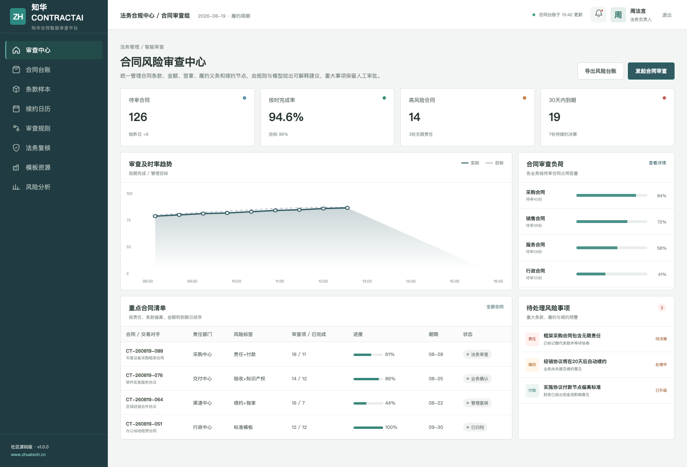
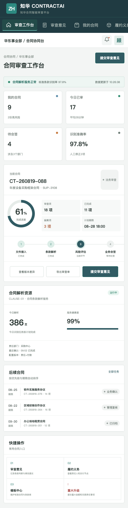

# Zhuatech ContractAI｜知华合同智能审查平台

面向中小企业法务、采购、销售和项目交付团队的合同全生命周期社区版。系统对必备条款、无限责任、付款偏离、重大金额、自动续约与到期日进行可解释评分，不替代法务人员作出最终决定。

[知华科技官网](https://www.zhuatech.cn/) · 上海如静知华信息科技有限公司 · Java 包名 `cn.zhuatech.contractai`



## 一条合同如何被处理

`文件接入 → 条款解析 → 风险评估 → 业务会签 → 签署归档 → 履约/续约提醒`

- 条款比对：识别必备、替代与禁止条款，展示原文位置和风险解释。
- 风险路由：重大金额、无限责任和非标准付款自动进入相应审批队列。
- 履约跟踪：维护交付、付款、保密、终止和续约义务。
- 人工门禁：所有模型结果都是建议，签署决定由授权业务与法务人员完成。
- 审计留痕：保存版本差异、规则版本、审查意见与会签记录。

### 经办人移动工作台



## 技术与运行

后端采用 Java 21、Spring Boot、Spring Security/JWT、JPA、Flyway；前端采用 Vue 3、Vite、Pinia；生产数据库使用 MySQL 8，测试使用 H2。

```bash
docker compose up --build
```

打开 `http://localhost:5173`。演示账号：`admin / Demo@2026`、`operator / Demo@2026`。核心接口：`POST /api/ai/contract/analyze`。更多说明见 [API](docs/api.md)、[架构](docs/architecture.md)和[数据库](docs/database.md)。

## 使用边界与服务

本工程仅限个人非商业学习、研究和技术交流，**不得商用**。企业内部使用、生产部署、SaaS、实施交付、收费服务、品牌替换或商业再发行，须事先取得上海如静知华信息科技有限公司书面授权，详见 [LICENSE](LICENSE)。

需要合同管理、法务数字化、AI 私有化、软件外包、FDE 或深度开发定制，请访问[知华科技官网](https://www.zhuatech.cn/)或扫码咨询：

| 微信咨询一 | 微信咨询二 |
| --- | --- |
|  |  |

Copyright © 2026 上海如静知华信息科技有限公司
